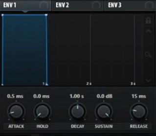
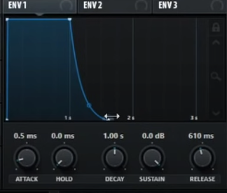

# [How to make the Most Important Sounds in EDM (beginner synth tutorial)](https://www.youtube.com/watch?v=GmUYXWKNJMM)
## Saw Wave (any synth)
1. Start with Saw
2. Crank up unison
3. Increase release time

